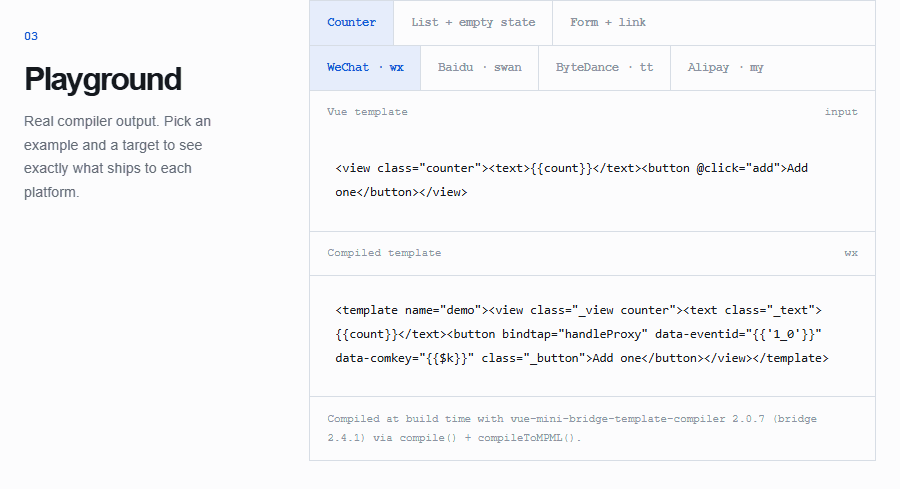
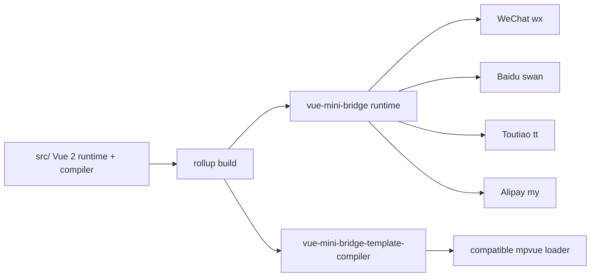

# Vue Mini Bridge

Vue Mini Bridge is an independently maintained Vue-compatible runtime and template compiler for mini-program targets.

It continues the useful parts of the original mpvue platform work while rebuilding the toolchain, documenting behavior in English, and adding regression coverage for current developer environments.

**Website:** https://archerkattri.github.io/vue-mini-bridge/ — usage, platform matrix, and a compiler playground showing real output for every target.



## Platform compatibility

Checked against the vendors' current documentation (September 2026). Upstream mpvue is dormant — last release 1.4.4 in May 2019, last commit March 2022 — while all four vendors kept their template primitives stable.

| Platform | Target | Template dialect | Compatibility |
| --- | --- | --- | --- |
| WeChat | `wx` | `wx:if`, `wx:for`, `bindtap`, `<template>` | Base library 3.x. Template/import/include plus `setData` is the maintained glass-easel compiler path in both WebView and Skyline renderers. Validate on the latest DevTools. |
| Alipay | `my` | `a:if`, `a:for`, `onTap` | AXML directives stable for years; platform and Mini Program Studio actively maintained. Verify on the current IDE. |
| Baidu | `swan` | `s-if`, `s-for`, `bindtap` | Swan template syntax stable. Verify on current Baidu developer tools. |
| Toutiao / ByteDance | `tt` | `tt:if`, `tt:for`, `bindtap` | TTML template syntax stable. Verify on current Douyin developer tools. |

## Status

The project is under active modernization. The runtime/compiler behavior is intentionally kept close to the upstream contract while the build and test infrastructure are being replaced. Do not treat an unreleased branch as a drop-in production upgrade yet.

Supported target adapters currently present in the source tree:

- WeChat (`wx`)
- Baidu (`swan`)
- Toutiao (`tt`)
- Alipay (`my`)

## Packages

The independent package names are:

- `vue-mini-bridge` — the mini-program runtime
- `vue-mini-bridge-template-compiler` — the template compiler used by a compatible loader

Both packages are generated from the source tree during a release build. Make changes under `src/`, then run the build before publishing.



## Usage

Inside a mini-program project (where the platform provides `App` and `Page`),
mount a page through the runtime entry point:

```js
const Vue = require('vue-mini-bridge');

const page = new Vue({
  data: { msg: 'hello' }
});

Vue.createMP({
  mpType: 'page', // 'app' | 'page' | 'component'
  init: () => page
});
```

Compile a template to mini-program markup:

```js
const { compile, compileToMPML } = require('vue-mini-bridge-template-compiler');

const output = compileToMPML(compile('<div>{{msg}}</div>', {}), { name: 'page' });
```

## Development

Requirements: Node.js 22 or newer and Yarn 1.x (via Corepack) while the dependency graph is being migrated.

```sh
corepack yarn install
npm run lint
npm run build:mpvue
```

## Support matrix

| Area | Status |
| ---- | ------ |
| Node.js runtime | 22 and 24 supported (`engines: node >= 22`) |
| Mini-program runtime (`vue-mini-bridge`) | Maintained; covered by `npm run test:mp` |
| Template compiler (`vue-mini-bridge-template-compiler`) | Maintained; covered by `npm run test:mp` |
| Target adapters | WeChat (`wx`), Baidu (`swan`), Toutiao (`tt`), Alipay (`my`) |
| Aggregate `npm test` | Supported: lint, flow, types, ssr (92), weex (67), mpvue (76) |

```sh
npm test
```

Focused checks also pass individually (`npm run lint`, `npm run flow`,
`npm run build:mpvue`, `npm run test:mp`).

Set `SOURCE_DATE_EPOCH` to pin the banner year for reproducible builds.

The maintenance record, live upstream issue/PR review, and upgrade sequence are in [`MAINTENANCE.md`](MAINTENANCE.md).

## Relationship to upstream

This repository continues [mpvue](https://github.com/Meituan-Dianping/mpvue)
by Meituan, itself a fork of [vuejs/vue@2.4.1](https://github.com/vuejs/vue).
The original MIT license and attribution are preserved in [`LICENSE`](LICENSE),
and the historical source is available as the `upstream` Git remote. Vue Mini
Bridge is not affiliated with Meituan, Vue, or any mini-program platform vendor.

## License

MIT. See [`LICENSE`](LICENSE).
